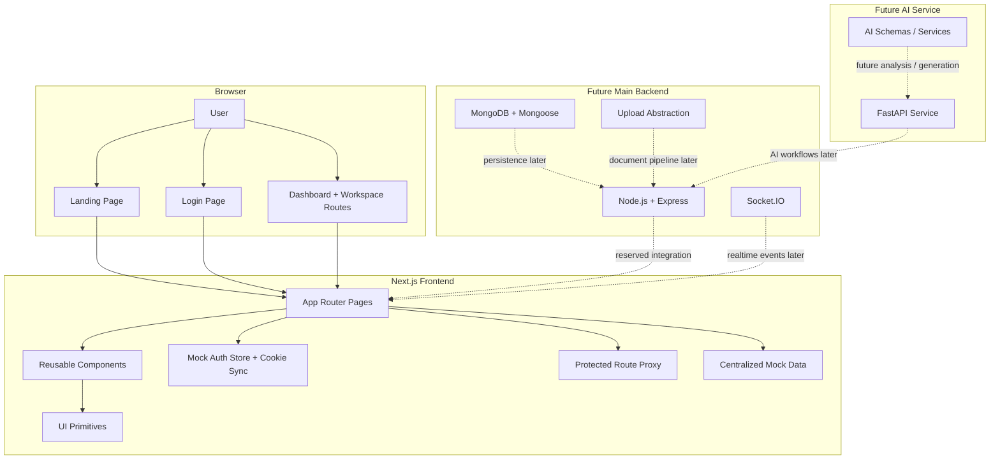

# StudySync AI

StudySync AI is a collaborative student workspace for study groups, project teams, hackathon squads, clubs, and academic collaborators.

Stage 1 is complete as a frontend-first product shell:

- a Swiss-inspired landing page rebuilt in Next.js
- a mocked auth flow with protected routing
- a custom student collaboration dashboard
- placeholder product routes with a consistent workspace shell
- backend and AI service scaffolds reserved for later implementation

## Stage 1 Status

### What is already live

- Premium landing page with strong Swiss / startup product styling
- Dedicated `/login` flow with frontend validation
- Mock auth state in local storage
- protected workspace routing through Next proxy
- Custom `/dashboard` built as a student collaboration control center
- Placeholder routes for rooms, messages, documents, whiteboard, sessions, notifications, and settings
- Shared UI primitives and reusable component structure
- Backend scaffold for Node.js + Express + Socket.IO + MongoDB
- AI service scaffold for FastAPI

### Hot core implemented right now

- Product-grade landing page, not a generic template dump
- Right-side hero now previews the StudySync product surface instead of decorative filler
- Segmented dark workspace sidebar with route awareness
- Strong dashboard hierarchy with stats, room focus, messaging, files, whiteboard, sessions, reminders, and activity feed
- Root-level scripts so the app can be run safely from the repo root

## High-Level Core Flow

```mermaid
flowchart LR
    A[Visitor lands on /] --> B[StudySync landing page]
    B --> C[Click Get Started / Sign In]
    C --> D[/login]
    D --> E[Frontend validation]
    E --> F[Mock auth store writes localStorage]
    F --> G[Auth cookie written for route protection]
    G --> H[/dashboard]
    H --> I[Workspace shell]
    I --> J[Rooms module]
    I --> K[Messages preview]
    I --> L[Documents preview]
    I --> M[Whiteboard preview]
    I --> N[Sessions preview]
    I --> O[Notifications preview]
```

## Architecture Diagram



## Implemented Features In Stage 1

### Frontend product layer

- Landing page sections:
  - Hero
  - Stats strip
  - Product preview cards
  - Capabilities section
  - Why StudySync section
  - Workflow section
  - Testimonials
  - CTA footer
- Login page:
  - email
  - password
  - demo user entry
  - frontend validation
  - redirect to dashboard
- Dashboard modules:
  - welcome header
  - quick stats
  - study rooms
  - messaging preview
  - document sharing preview
  - whiteboard preview
  - video session preview
  - reminders
  - activity feed
- Route placeholders:
  - `/rooms`
  - `/messages`
  - `/documents`
  - `/whiteboard`
  - `/sessions`
  - `/notifications`
  - `/settings`

### Engineering layer

- TypeScript-based Next.js App Router setup
- Tailwind CSS styling layer
- shadcn-style component structure
- Zustand-based auth state
- React Query provider scaffold
- Centralized mock content
- Workspace shell with responsive navigation
- Protected route handling using cookie + proxy

## Route Map

| Route | Status | Notes |
|---|---|---|
| `/` | Implemented | Premium StudySync landing page |
| `/login` | Implemented | Mock auth and validation |
| `/dashboard` | Implemented | Full custom dashboard |
| `/rooms` | Scaffolded | Placeholder workspace page |
| `/messages` | Scaffolded | Placeholder workspace page |
| `/documents` | Scaffolded | Placeholder workspace page |
| `/whiteboard` | Scaffolded | Placeholder workspace page |
| `/sessions` | Scaffolded | Placeholder workspace page |
| `/notifications` | Scaffolded | Placeholder workspace page |
| `/settings` | Scaffolded | Placeholder workspace page |

## Current Repo Shape

```text
.
├── frontend/
│   ├── app/
│   ├── components/
│   │   ├── dashboard/
│   │   ├── landing/
│   │   ├── shared/
│   │   └── ui/
│   ├── hooks/
│   ├── lib/
│   │   ├── auth/
│   │   ├── constants/
│   │   ├── mock/
│   │   └── utils/
│   ├── public/theme/
│   └── next.config.ts
├── backend/
│   ├── node-api/
│   │   └── src/
│   │       ├── config/
│   │       ├── controllers/
│   │       ├── middleware/
│   │       ├── models/
│   │       ├── routes/
│   │       ├── services/
│   │       └── sockets/
│   └── ai-service/
│       └── app/
│           ├── api/
│           ├── schemas/
│           └── services/
├── Swiss _ Design Prompts.html
└── README.md
```

## Theme Migration Notes

- Source HTML theme: `Swiss _ Design Prompts.html`
- Source asset folder: `Swiss _ Design Prompts_files/`
- Extracted assets used in app: `frontend/public/theme/`
- Preserved visual language:
  - strong black borders
  - white / off-white surfaces
  - red accent system
  - oversized uppercase typography
  - editorial grid sections
  - hover-driven product cards

## Run The Project

### Recommended

Run from the repo root:

```bash
npm install
npm run dev
```

### Direct frontend run

```bash
cd frontend
npm install
npm run dev
```

Open:

```text
http://localhost:3000
```

## Verification

Current verified commands:

```bash
npm run build
npm run lint
```

These run from the repo root and delegate into `frontend/`.

## Mock Auth Behavior

- Login is frontend-only in Stage 1
- Valid submit stores auth state in local storage
- Cookie sync is used so protected routes can be enforced in Next proxy
- Unauthenticated direct visits to workspace routes redirect to `/login`
- Authenticated visits to `/login` redirect to `/dashboard`

## Reserved Backend Integration Points

### Main backend

- Node.js + Express app scaffolded in `backend/node-api/`
- Socket.IO placeholder for realtime room and messaging events
- MongoDB + Mongoose placeholder for persistence
- Upload abstraction placeholder for future document management

### AI service

- FastAPI app scaffolded in `backend/ai-service/`
- Reserved for:
  - summarization
  - study assistance
  - room intelligence
  - future AI workflows

## Next Build Phases

1. Replace mock auth with real auth API
2. Add room CRUD and membership flows
3. Implement realtime messaging with Socket.IO
4. Implement document upload and room-linked resources
5. Add whiteboard collaboration
6. Add video session integration
7. Introduce FastAPI-powered AI workflows after collaboration core is stable

## Summary

StudySync AI Stage 1 already delivers a serious frontend demo:

- strong visual identity
- coherent product story
- protected auth flow
- custom dashboard shell
- backend-ready architecture

It is no longer a theme export. It is a structured product base ready for the next hackathon build phase.
