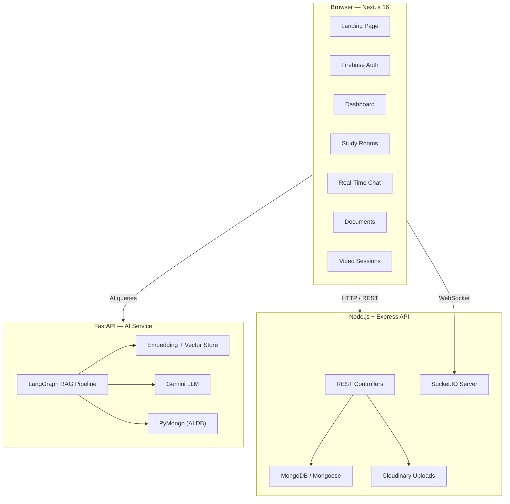
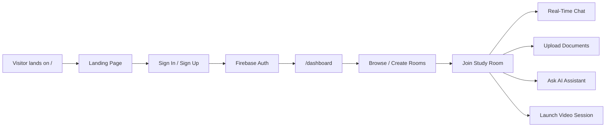
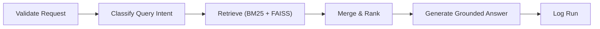

# StudySync AI

> **The all-in-one collaborative workspace for students — study rooms, real-time chat, document sharing, AI-powered Q&A, video sessions, and more.**

---

## 🚀 Features & Problem Statement

Students working in groups — for coursework, hackathons, clubs, or research — constantly juggle **fragmented tools**. StudySync AI brings everything into **one unified workspace**. Here's what it offers and why:

| Feature | Problem It Solves | How It Solves It |
|---|---|---|
| **Private Study Rooms** | Groups have no dedicated, persistent space to collaborate — conversations scatter across WhatsApp, Discord, and email | Invite-only rooms with member management, shared chat history, documents, and tasks — all in one place |
| **Public Study Rooms** | Students studying the same subject can't easily find and help each other | A browsable directory of open study channels anyone can join, filtered by topic or interest |
| **Real-Time Messaging** | Group chats in external apps lose context and aren't tied to study materials | WebSocket-powered live chat inside each room with full message persistence — no page refresh needed |
| **Document Sharing** | Study materials get buried in email threads and cloud drives with no link to the group's discussions | Upload, organize, and share files directly within a room using Cloudinary-backed storage; documents stay alongside the conversation |
| **AI Study Assistant (RAG)** | Students spend hours re-reading notes to find specific answers before exams | Ask natural-language questions about uploaded documents — a LangGraph + Gemini pipeline retrieves relevant chunks and generates grounded, cited answers |
| **Video Sessions** | Switching to a separate video tool (Zoom, Meet) breaks flow and requires sharing new links each time | Launch Jitsi-powered group video calls directly from any room with a single click — no external links needed |
| **Task & Reminder Tracking** | Group assignments slip through the cracks with no shared to-do list | Shared task boards and reminders within each room keep everyone aligned on deadlines |
| **Activity Feed** | Hard to know what happened while you were away across multiple groups | A unified feed shows recent actions — new messages, uploads, member joins — across all your rooms at a glance |
| **Firebase Authentication** | Building secure auth from scratch is error-prone and time-consuming | Production-grade sign-in with Google & email via Firebase, with cookie-synced session protection on every route |
| **Student Dashboard** | No single view to see all your groups, stats, and upcoming tasks | A personalized control center with quick stats, active rooms, recent messages, upcoming sessions, and reminders |

---

## 🏗️ Tech Stack

### Frontend
- **Framework:** Next.js 16 (App Router) with React 19
- **Language:** TypeScript
- **Styling:** Tailwind CSS 4
- **State Management:** Zustand + React Query (TanStack Query)
- **Real-Time:** Socket.IO Client
- **Video:** Jitsi Meet integration via custom `useJitsi` hook
- **Auth:** Firebase SDK
- **UI Kit:** shadcn-style primitives (Button, Card, Badge, Input, Textarea, Separator)
- **Icons:** Lucide React
- **Animations:** Lottie (dotlottie-react)
- **Validation:** Zod 4

### Backend — Node API
- **Runtime:** Node.js with Express
- **Database:** MongoDB + Mongoose
- **Real-Time:** Socket.IO (room-scoped messaging & presence)
- **File Uploads:** Multer + Cloudinary
- **Models:** User, Room, RoomInvite, Message, Document, Task, Note, Post, Duel

### Backend — AI Service
- **Framework:** FastAPI + Uvicorn
- **LLM:** Google Gemini (via `google-generativeai` + LangChain)
- **RAG Pipeline:** LangGraph orchestration with multi-node graph
  - Query intent classification
  - BM25 + FAISS hybrid retrieval
  - Merge-rank re-ranking
  - Grounded answer generation
- **Document Processing:** pdfplumber-based chunking & indexing
- **Database:** PyMongo (separate AI collections)
- **Embeddings:** Pluggable (local hash fallback, extensible to cloud models)

---

## 📐 Architecture



---

## 📂 Repository Structure

```text
.
├── frontend/                          # Next.js 16 App Router
│   ├── app/
│   │   ├── layout.tsx                 # Root layout with providers
│   │   ├── page.tsx                   # Landing page entry
│   │   ├── globals.css                # Global styles & Tailwind config
│   │   ├── login/                     # Authentication page
│   │   ├── dashboard/                 # Student collaboration dashboard
│   │   ├── rooms/                     # Private room view
│   │   ├── public-rooms/              # Browse & join public study rooms
│   │   ├── messages/                  # Messaging workspace
│   │   ├── documents/                 # Document management
│   │   ├── whiteboard/                # Collaborative whiteboard
│   │   ├── sessions/                  # Video session launcher
│   │   ├── notifications/             # Notification center
│   │   └── settings/                  # User settings
│   ├── components/
│   │   ├── dashboard/                 # Dashboard header & overview
│   │   ├── landing/                   # Hero, features, CTA, testimonials, etc.
│   │   ├── rooms/                     # Room index, private room, public rooms, create panel
│   │   ├── sessions/                  # Jitsi meeting component
│   │   ├── shared/                    # Login form, sidebar nav, workspace shell, etc.
│   │   ├── providers/                 # App-wide provider wrappers
│   │   └── ui/                        # Badge, Button, Card, Input, Separator, Textarea
│   ├── hooks/
│   │   ├── use-jitsi.ts               # Jitsi Meet integration hook
│   │   └── use-live-date.ts           # Live clock hook
│   ├── lib/
│   │   ├── api/                       # Private room API helpers
│   │   ├── auth/                      # Auth store & cookie sync
│   │   ├── constants/                 # App-wide constants
│   │   ├── mock/                      # Mock data for development
│   │   ├── rooms/                     # Room Zustand store
│   │   ├── ui/                        # UI utilities
│   │   ├── utils/                     # General utilities
│   │   ├── firebase.ts                # Firebase client init
│   │   └── socket.ts                  # Socket.IO client singleton
│   └── public/theme/                  # Static theme assets
│
├── backend/
│   ├── node-api/                      # Express + Socket.IO backend
│   │   └── src/
│   │       ├── index.js               # Server entry point
│   │       ├── config/                # DB & environment config
│   │       ├── controllers/           # Room, Document, User, Task, Content
│   │       ├── middleware/             # Express middleware
│   │       ├── models/                # Mongoose schemas (User, Room, Message, …)
│   │       ├── routes/                # REST route definitions
│   │       ├── services/              # Business logic layer
│   │       └── sockets/               # Socket.IO event handlers
│   │
│   └── ai-service/                    # FastAPI AI micro-service
│       ├── app/
│       │   ├── main.py                # FastAPI entry point
│       │   ├── api/routes/            # Health + Room AI endpoints
│       │   ├── core/                  # Settings & configuration
│       │   ├── db/                    # PyMongo connection
│       │   ├── schemas/               # Pydantic request/response models
│       │   ├── services/              # Chunker, retriever, embeddings, vector store, …
│       │   └── graph/                 # LangGraph RAG flow
│       │       ├── rag_graph.py       # Graph definition
│       │       ├── state.py           # Graph state schema
│       │       └── nodes/             # Classify → Retrieve → Merge-Rank → Generate
│       ├── storage/                   # Local document storage
│       └── requirements.txt           # Python dependencies
│
├── .env.example                       # Environment variable template
├── package.json                       # Root scripts (dev, build, lint)
└── README.md
```

---

## 🔀 Core User Flow



---

## 🖥️ Route Map

| Route | Status | Description |
|---|---|---|
| `/` | ✅ Live | Premium landing page with hero, features, testimonials, CTA |
| `/login` | ✅ Live | Firebase-backed authentication |
| `/dashboard` | ✅ Live | Student collaboration dashboard |
| `/rooms` | ✅ Live | Private study rooms with invites & chat |
| `/public-rooms` | ✅ Live | Browse and join public study channels |
| `/messages` | 🔲 Scaffold | Direct messaging workspace |
| `/documents` | 🔲 Scaffold | Document management view |
| `/whiteboard` | 🔲 Scaffold | Collaborative whiteboard |
| `/sessions` | ✅ Live | Jitsi-powered video meetings |
| `/notifications` | 🔲 Scaffold | Notification center |
| `/settings` | 🔲 Scaffold | User preferences |

---

## ⚡ Getting Started

### Prerequisites

- **Node.js** ≥ 18
- **Python** ≥ 3.10
- **MongoDB** (local or Atlas)
- **Firebase** project (for auth)
- **Cloudinary** account (for document uploads — optional)
- **Google AI API key** (for Gemini-powered AI — optional)

### 1. Clone & install

```bash
git clone https://github.com/Aj-Levi/III-student-learning.git
cd III-student-learning

# Install frontend + root deps
npm install

# Install backend deps
cd backend/node-api && npm install && cd ../..

# Install AI service deps
cd backend/ai-service
python -m venv .venv
source .venv/bin/activate   # Windows: .venv\Scripts\activate
pip install -r requirements.txt
cd ../..
```

### 2. Configure environment

```bash
cp .env.example .env
# Fill in your Firebase, MongoDB, Cloudinary, and Google AI keys
```

### 3. Run everything

```bash
# All services concurrently (frontend + backend + AI)
npm run dev:all
```

Or run individually:

```bash
npm run dev            # Frontend → http://localhost:3000
npm run dev:backend    # Node API → http://localhost:4000
npm run dev:ai         # AI Service → http://localhost:8000
```

### 4. Verify

```bash
npm run build          # Production build (frontend)
npm run lint           # ESLint check
```

---

## 🔑 Environment Variables

| Variable | Purpose |
|---|---|
| `NEXT_PUBLIC_NODE_API_URL` | Node API endpoint |
| `NEXT_PUBLIC_SOCKET_URL` | Socket.IO endpoint |
| `NEXT_PUBLIC_FIREBASE_*` | Firebase client config (optional) |
| `PORT` | Node API port (Render uses `PORT`) |
| `FRONTEND_URL` / `FRONTEND_URLS` | Allowed frontend origins for CORS |
| `MONGO_URI` | MongoDB connection string (Node API) |
| `AI_SERVICE_MONGO_URI` | MongoDB connection string (AI service) |
| `GOOGLE_API_KEY` | Gemini API key for AI features |
| `SARVAM_API_KEY` | Sarvam ASR key for transcript conversion |
| `REDIS_ENABLED` / `REDIS_URL` | Socket.IO multi-instance pub/sub adapter |
| `CLOUDINARY_CLOUD_NAME` / `_API_KEY` / `_API_SECRET` | Cloudinary credentials |
| `EMBEDDING_MODEL` | Embedding model selector |
| `GENERATION_MODEL` | LLM model selector (default: `gemini-2.5-flash`) |

See [`.env.example`](.env.example), [backend/node-api/.env.example](backend/node-api/.env.example), and [backend/ai-service/.env.example](backend/ai-service/.env.example).

---

## 🧠 AI Pipeline (RAG)

The AI service uses a **LangGraph** state-machine to orchestrate retrieval-augmented generation:



- **Documents** are chunked via `pdfplumber` and indexed into both a BM25 store and a FAISS vector store.
- **Hybrid retrieval** combines keyword (BM25) and semantic (vector) search results.
- **Merge-rank** re-orders results for relevance before passing to Gemini for answer generation.
- All answers are **grounded** — the model cites which document chunks informed its response.

---

## 🗄️ Database Models (Node API)

| Model | Purpose |
|---|---|
| `User` | Student profiles |
| `Room` | Study room metadata, members, settings |
| `RoomInvite` | Invite links & codes for private rooms |
| `Message` | Chat messages (channel-scoped, persisted) |
| `Document` | Uploaded files & metadata |
| `Task` | Shared to-do items within a room |
| `Note` | Personal or shared study notes |
| `Post` | Room posts / announcements |
| `Duel` | Gamified quiz challenges between students |

---

## 🗺️ Roadmap

- [x] Premium landing page
- [x] Firebase authentication
- [x] Private study rooms with invite system
- [x] Public study rooms (browse & join)
- [x] Real-time WebSocket messaging
- [x] Document upload & Cloudinary storage
- [x] AI-powered RAG Q&A on uploaded documents
- [x] Jitsi video sessions
- [x] Dashboard with stats, activity feed, reminders
- [ ] Direct messaging between users
- [ ] Collaborative whiteboard
- [ ] Notification system
- [ ] Gamified duels / quiz battles
- [ ] Mobile-responsive polish
- [ ] Deployment to production (Vercel + Railway / Render)

---

## 📄 License

This project is part of an academic / hackathon initiative. See the repository for license details.
